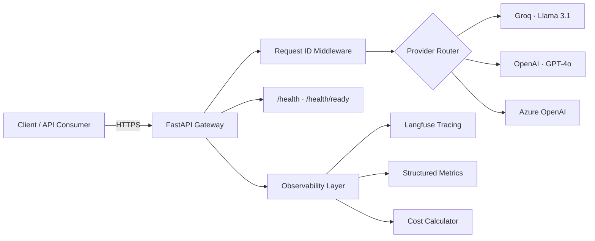
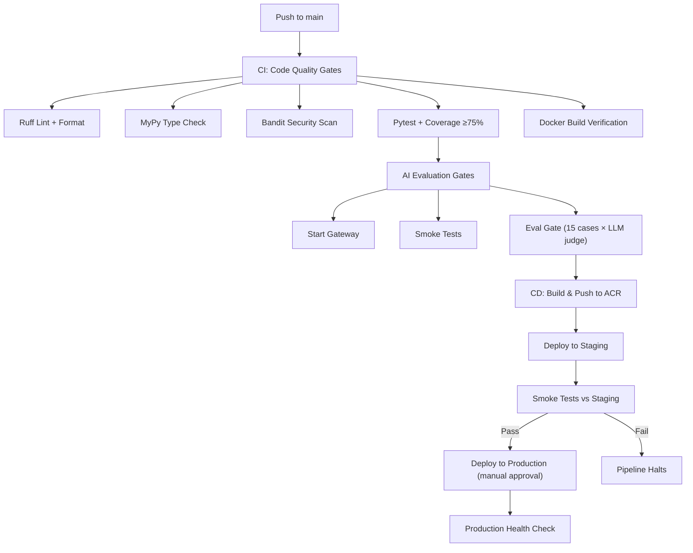
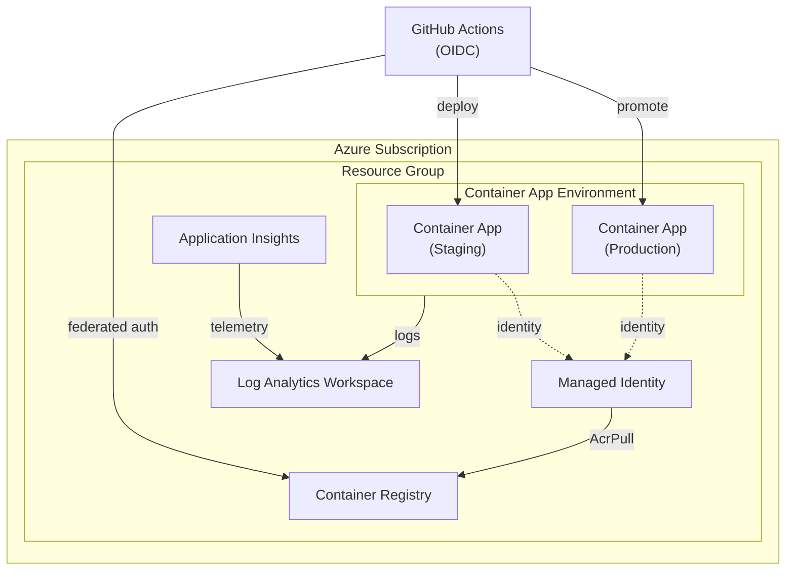

<div align="center">

# Production GenAI MLOps Platform

**A production-grade LLM gateway with automated CI/CD, infrastructure as code, observability, and AI evaluation gates — built to demonstrate how GenAI services should actually ship to production.**

[](https://github.com/TechySan031/Production-GenAI-MLOps-Platform/actions/workflows/ci.yml)
[](https://github.com/TechySan031/Production-GenAI-MLOps-Platform/actions/workflows/cd.yml)
[](https://github.com/TechySan031/Production-GenAI-MLOps-Platform/actions/workflows/terraform.yml)
[](#)
[](LICENSE)
[](#azure-architecture)
[](#infrastructure-as-code)

</div>

---

## Table of Contents

- [Overview](#overview)
- [Architecture](#architecture)
- [Tech Stack](#tech-stack)
- [Project Structure](#project-structure)
- [Local Development](#local-development)
- [API Reference](#api-reference)
- [CI/CD Pipeline](#cicd-pipeline)
- [Azure Architecture](#azure-architecture)
- [Infrastructure as Code](#infrastructure-as-code)
- [Security Model](#security-model)
- [Observability & Monitoring](#observability--monitoring)
- [AI Evaluation Gates](#ai-evaluation-gates)
- [Deployment Guide](#deployment-guide)
- [Troubleshooting](#troubleshooting)
- [Roadmap](#roadmap)
- [Contributing](#contributing)

---

## Overview

This is an **LLM gateway** — a FastAPI service that sits between client applications and LLM providers (Groq, OpenAI, Azure OpenAI). It's deployed with a production-grade pipeline that:

- **Builds once, promotes everywhere** — the same Docker image moves from staging to production
- **Uses OIDC federation** — no stored cloud credentials in CI/CD
- **Enforces AI quality gates** — automated evaluation scoring before deployment
- **Manages infrastructure as code** — Terraform for Azure resources with remote state

Every push to `main` triggers: lint → type check → security scan → unit tests → Docker build → AI evaluation → staging deploy → smoke test → production promotion (with manual approval gate).

---

## Architecture



The gateway is intentionally a thin, well-bounded layer:

| Layer | Responsibility |
|-------|---------------|
| **Routes** | Request validation, HTTP error mapping |
| **LLM Service** | Orchestration, observability integration |
| **Providers** | Vendor-specific API calls behind `BaseProvider` interface |
| **Observability** | Langfuse tracing, cost tracking, structured metrics |
| **Config** | Environment-driven settings with fail-fast validation |

---

## Tech Stack

| Category | Technology |
|----------|-----------|
| **Runtime** | Python 3.11, FastAPI, Uvicorn |
| **LLM Providers** | Groq (Llama 3.1), OpenAI (GPT-4o), Azure OpenAI |
| **Validation** | Pydantic v2, Pydantic Settings |
| **Observability** | Langfuse, Azure Monitor, structured JSON logging |
| **Infrastructure** | Terraform, Azure Container Apps, ACR, Log Analytics |
| **CI/CD** | GitHub Actions (OIDC auth), Docker BuildX |
| **Testing** | Pytest, pytest-cov, pytest-asyncio |
| **Linting** | Ruff (lint + format), MyPy, Bandit |
| **Container** | Multi-stage Docker, non-root user, pinned base images |

---

## Project Structure

```
├── app/                           # Application source code
│   ├── main.py                    # FastAPI app factory + lifespan
│   ├── config.py                  # Environment-driven settings (Pydantic)
│   ├── logging_config.py          # Structured JSON / text logging
│   ├── api/
│   │   ├── routes/
│   │   │   ├── health.py          # Liveness + readiness probes
│   │   │   └── chat.py            # OpenAI-compatible /chat endpoint
│   │   └── middleware/
│   │       └── request_id.py      # X-Request-ID correlation
│   ├── models/
│   │   ├── requests.py            # Input validation schemas
│   │   └── responses.py           # OpenAI-compatible response schemas
│   ├── observability/
│   │   ├── langfuse_client.py     # Null Object pattern tracing
│   │   ├── cost_calculator.py     # Per-request cost estimation
│   │   └── metrics.py             # Structured metrics for Azure Monitor
│   └── services/
│       ├── llm_service.py         # LLM orchestration layer
│       └── providers/
│           ├── base.py            # Abstract provider interface
│           ├── openai_provider.py
│           ├── groq_provider.py
│           └── azure_openai_provider.py
├── infra/
│   └── terraform/                 # Azure infrastructure definitions
│       ├── main.tf                # Locals (naming, tags)
│       ├── providers.tf           # Terraform + AzureRM provider config
│       ├── backend.tf             # Remote state (partial config)
│       ├── variables.tf           # Input variables with validation
│       ├── outputs.tf             # CI/CD-consumable outputs
│       ├── resource_group.tf
│       ├── acr.tf                 # Container Registry
│       ├── container_app.tf       # Container App + health probes
│       ├── container_app_environment.tf
│       ├── log_analytics.tf
│       ├── app_insights.tf
│       ├── managed_identity.tf    # User-assigned identity
│       └── role_assignments.tf    # RBAC (AcrPull, Monitoring)
├── .github/workflows/
│   ├── ci.yml                     # Code quality + Docker build + AI eval
│   ├── cd.yml                     # Build → push → stage → smoke → prod
│   ├── terraform.yml              # IaC validation + plan
│   └── rollback.yml               # Manual production rollback
├── tests/                         # Pytest suite
├── scripts/
│   ├── smoke_test.py              # Deployment verification
│   └── eval/                      # AI evaluation gate
├── Dockerfile                     # Multi-stage, non-root, pinned
├── docker-compose.yml             # Local development
├── pyproject.toml                 # Dependencies + tool config
├── Makefile                       # Developer shortcuts
└── .env.example                   # Environment variable template
```

---

## Local Development

### Prerequisites

- Python 3.11+
- Docker (optional, for containerized development)
- An LLM API key (Groq free tier recommended for development)

### Quick Start

```bash
# 1. Clone and enter the project
git clone https://github.com/TechySan031/Production-GenAI-MLOps-Platform.git
cd Production-GenAI-MLOps-Platform

# 2. Create virtual environment
python -m venv .venv
source .venv/bin/activate  # Linux/macOS
# .venv\Scripts\activate   # Windows

# 3. Install dependencies
pip install -e ".[dev]"

# 4. Configure environment
cp .env.example .env
# Edit .env — set GROQ_API_KEY and LLM_PROVIDER=groq

# 5. Run the server
uvicorn app.main:app --reload --host 0.0.0.0 --port 8000
```

### Docker Development

```bash
# Start with hot-reload
docker compose up --build

# Run in background
docker compose up -d

# View logs
docker compose logs -f gateway

# Stop
docker compose down
```

### Makefile Commands

```bash
make install        # Install dependencies
make run            # Start dev server
make lint           # Run linters
make lint-fix       # Auto-fix lint issues
make typecheck      # MyPy type checking
make security       # Bandit security scan
make test           # Run tests
make test-cov       # Tests with coverage
make ci-check       # All quality gates
make docker         # Docker compose up
make smoke          # Run smoke tests
make eval           # Run AI evaluation
make clean          # Remove generated files
```

---

## API Reference

### Health Checks

```bash
# Liveness probe — is the process alive?
curl http://localhost:8000/health

# Readiness probe — can it serve traffic?
curl http://localhost:8000/health/ready
```

### Chat Completion (OpenAI-compatible)

```bash
curl -X POST http://localhost:8000/chat \
  -H "Content-Type: application/json" \
  -H "X-Request-ID: my-trace-123" \
  -d '{
    "messages": [
      {"role": "system", "content": "You are a helpful assistant."},
      {"role": "user", "content": "What is MLOps?"}
    ],
    "temperature": 0.7,
    "max_tokens": 500
  }'
```

**Response (OpenAI-compatible schema):**
```json
{
  "id": "chatcmpl-abc123def456",
  "object": "chat.completion",
  "created": 1700000000,
  "model": "llama-3.1-8b-instant",
  "choices": [
    {
      "index": 0,
      "message": {
        "role": "assistant",
        "content": "MLOps (Machine Learning Operations) is..."
      },
      "finish_reason": "stop"
    }
  ],
  "usage": {
    "prompt_tokens": 25,
    "completion_tokens": 150,
    "total_tokens": 175
  }
}
```

### Interactive Docs

When `ENVIRONMENT != production`, Swagger UI is available at `/docs` and ReDoc at `/redoc`.

---

## CI/CD Pipeline



### Key Design Decisions

- **Image immutability**: Build once, promote through environments. What passed staging is exactly what runs in production, byte for byte.
- **OIDC authentication**: GitHub Actions receives short-lived Azure tokens at runtime. No stored cloud credentials to rotate or leak.
- **Concurrency control**: CI cancels in-progress PR runs; CD never cancels in-flight deployments.

---

## Azure Architecture



### Resources

| Resource | Purpose |
|----------|---------|
| **Container Registry** | Docker image storage (Managed Identity auth) |
| **Container App** | Serverless compute with auto-scaling |
| **Container App Environment** | Shared hosting with Log Analytics integration |
| **Managed Identity** | Zero-secret Azure service authentication |
| **Log Analytics** | Centralized log aggregation and querying |
| **Application Insights** | Performance monitoring and request tracing |
| **RBAC Assignments** | AcrPull + Monitoring Metrics Publisher |

---

## Infrastructure as Code

All Azure resources are defined in Terraform (`infra/terraform/`).

### Initialize

```bash
cd infra/terraform

# Initialize with backend configuration
terraform init \
  -backend-config="resource_group_name=genai-gateway-rg" \
  -backend-config="storage_account_name=tfstategenaigateway" \
  -backend-config="container_name=tfstate" \
  -backend-config="key=staging.tfstate"
```

### Plan & Apply

```bash
# Review changes
terraform plan -var-file="terraform.tfvars"

# Apply infrastructure
terraform apply -var-file="terraform.tfvars"

# View outputs
terraform output
```

### Key Terraform Decisions

- **Partial backend config**: Backend values provided at init time, not hardcoded in source
- **DRY tagging**: All resources share `local.common_tags` — single source of truth
- **Variable validation**: Input constraints enforce valid Azure regions, environments, and resource sizing
- **Sensitive outputs**: Connection strings and keys are marked `sensitive` to prevent CI log exposure

---

## Security Model

| Threat | Mitigation |
|--------|-----------|
| Leaked cloud credentials | **OIDC federation** — no stored Azure secrets in GitHub |
| Container compromise | **Non-root user** — containers run as `appuser:1000` |
| Secret logging | **Pydantic SecretStr** — API keys never appear in logs or error messages |
| Excessive permissions | **RBAC least-privilege** — AcrPull only (not AcrPush) |
| Dependency vulnerabilities | **Bandit** security scanning in CI + **pinned** base images |
| Input injection | **Pydantic validation** — all inputs validated with type constraints |
| CORS abuse | **Configurable origins** — not wildcard in production |
| Observability failures | **Null Object pattern** — Langfuse failures never propagate to inference |

---

## Observability & Monitoring

### Structured Logging

All logs are emitted as structured JSON (production) or human-readable text (development), controlled by `LOG_FORMAT`:

```json
{
  "timestamp": "2025-06-15T10:30:00Z",
  "level": "INFO",
  "logger": "app.services.llm_service",
  "message": "Chat request completed",
  "request_id": "abc-123",
  "model": "llama-3.1-8b-instant",
  "total_tokens": 175,
  "latency_ms": 342.5,
  "cost_usd": 0.0000175
}
```

### Langfuse Integration

When `LANGFUSE_ENABLED=true`, every request generates a Langfuse trace correlated by `X-Request-ID`:

- **Trace**: One per HTTP request (keyed on `X-Request-ID`)
- **Generation**: One per LLM call with model, tokens, cost, latency
- **Null Object pattern**: Langfuse failures = silent no-op, never a 500 error

### Cost Tracking

Per-request cost is calculated automatically based on model pricing tables, supporting OpenAI, Azure OpenAI, and Groq models with automatic Azure deployment name normalization.

---

## AI Evaluation Gates

Beyond health checks, the pipeline enforces **output quality** via AI evaluation gates:

1. **15 benchmark cases** across categories (factual, reasoning, coding, etc.)
2. **LLM judge** (Llama 3.3 70B) scores each response on quality criteria
3. **Regression detection**: Scores compared against stored baseline
4. **Pipeline enforcement**: Score drop below threshold = deployment blocked

This catches "the model's behavior got worse" — a failure mode that health checks and unit tests cannot detect.

---

## Deployment Guide

### Prerequisites

1. Azure subscription with Contributor access
2. GitHub repository with Actions enabled
3. Groq API key (free tier at [console.groq.com](https://console.groq.com))

### Step 1: Create Azure Infrastructure

```bash
# Create the Terraform state storage account
az storage account create \
  --name tfstategenaigateway \
  --resource-group genai-gateway-rg \
  --sku Standard_LRS

az storage container create \
  --name tfstate \
  --account-name tfstategenaigateway

# Deploy infrastructure
cd infra/terraform
terraform init -backend-config="..."
terraform apply
```

### Step 2: Configure GitHub

**Secrets** (Settings → Secrets and variables → Actions):
- `AZURE_CLIENT_ID` — OIDC service principal
- `AZURE_TENANT_ID` — Azure AD tenant
- `AZURE_SUBSCRIPTION_ID` — Azure subscription
- `GROQ_API_KEY` — Groq API key

**Variables** (Settings → Variables → Actions):
- `ACR_NAME` — Container Registry name
- `RESOURCE_GROUP` — Resource group name
- `STAGING_APP_NAME` — Staging Container App name
- `PROD_APP_NAME` — Production Container App name
- `KEY_VAULT_NAME` — Key Vault name (for rollback data)

### Step 3: Push and Deploy

```bash
git push origin main
# CI runs → CD deploys to staging → smoke tests → manual approval → production
```

### Manual Rollback

If production needs to revert:

1. Go to **Actions** → **Rollback Production** → **Run workflow**
2. Either specify a target image or leave blank to use the previous image from Key Vault
3. Approve via the production environment gate

---

## Troubleshooting

### Common Issues

| Symptom | Cause | Fix |
|---------|-------|-----|
| `422` on `/chat` | Invalid request body | Check message format: `{"messages": [{"role": "user", "content": "..."}]}` |
| `401` on `/chat` | Invalid LLM API key | Verify `GROQ_API_KEY` or `OPENAI_API_KEY` in `.env` |
| `502` on `/chat` | LLM provider unreachable | Check provider status; verify API base URL |
| `503` on `/health/ready` | Readiness check failed | Check API key configuration and provider connectivity |
| Startup crash | Missing config | Check `.env` matches `.env.example`; ensure required vars are set |
| Docker build fails | Dependency issue | Try `docker compose build --no-cache` |

### Viewing Logs

```bash
# Local development
uvicorn app.main:app --reload  # stdout

# Docker
docker compose logs -f gateway

# Azure Container Apps
az containerapp logs show \
  --name genai-gateway-staging \
  --resource-group genai-gateway-rg \
  --follow
```

---

## Roadmap

- [x] Multi-provider LLM gateway (OpenAI, Groq, Azure OpenAI)
- [x] Structured logging and request correlation
- [x] Langfuse observability integration
- [x] Per-request cost tracking
- [x] CI pipeline (lint, type check, security, tests, coverage)
- [x] Docker multi-stage build with security hardening
- [x] Azure Container Apps deployment (staging + production)
- [x] OIDC authentication (zero stored credentials)
- [x] Terraform infrastructure as code
- [x] AI evaluation gates with LLM judge scoring
- [x] Manual rollback workflow
- [ ] OpenTelemetry integration with Azure Monitor
- [ ] Load testing with published p50/p95/p99 latency numbers
- [ ] Cost-aware provider routing (escalate to stronger model on low confidence)
- [ ] Rate limiting middleware
- [ ] API key authentication for multi-tenant access
- [ ] Streaming response support (SSE)
- [ ] Prompt caching / semantic deduplication
- [ ] Multi-region deployment with traffic manager

---

## Contributing

See [CONTRIBUTING.md](CONTRIBUTING.md) for development setup, code quality requirements, and pull request guidelines.

---

<div align="center">

**Built as a production engineering portfolio piece** — demonstrating how GenAI services should ship, not just how they should function.

[Architecture](#architecture) · [Deploy](#deployment-guide) · [Security](#security-model) · [Roadmap](#roadmap)

</div>