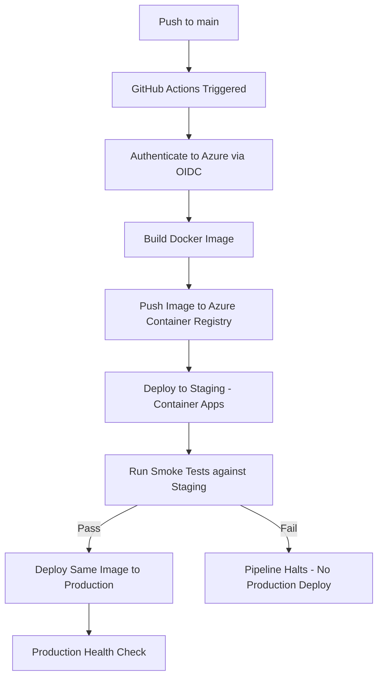
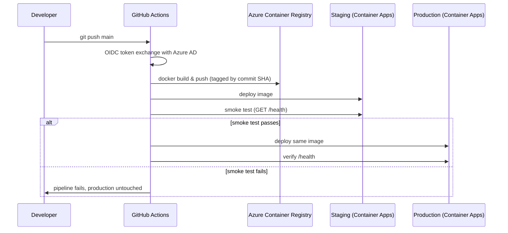
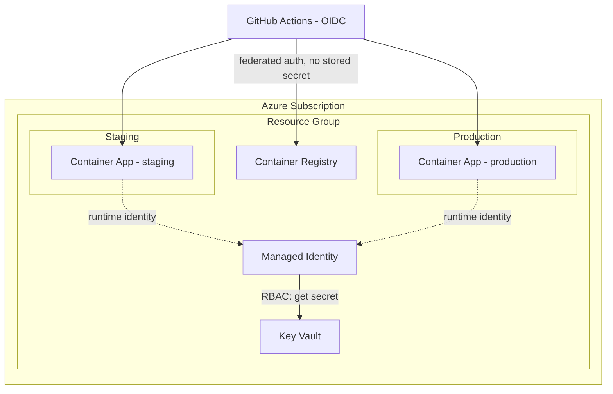

<div align="center">

# Production GenAI MLOps Platform

**A FastAPI-based LLM gateway with a fully automated cloud deployment pipeline — built to demonstrate how GenAI services should actually ship to production.**

[](#)
[](#)
[](#)
[](#)

[Live Demo](#) · [Architecture](#architecture) · [CI/CD Pipeline](#cicd-pipeline) · [Security Model](#security)

<br>

`<!-- placeholder: architecture-hero.png — wide diagram showing Git push → CI/CD → ACR → Container Apps (staging/prod) → live endpoint -->`

</div>

<br>

---

## 30-Second Overview

This is an LLM gateway — a FastAPI service that sits between client applications and LLM providers (currently Groq running Llama 3.1, with a provider abstraction designed to support others) — deployed the way a real cloud team would deploy it, not the way a tutorial would.

Every push to `main` runs through a pipeline that builds a Docker image, pushes it to Azure Container Registry, deploys it to a staging environment, runs smoke tests against that staging deployment, and only then promotes the same image to production on Azure Container Apps. Authentication between GitHub and Azure uses OIDC federation — no long-lived cloud credentials are stored anywhere in this repository. Secrets live in Azure Key Vault and are retrieved at runtime via Managed Identity.

The infrastructure itself — registries, container apps, identities, RBAC role assignments — is defined in Bicep and version-controlled alongside the application code, so the environment can be reconstructed from source rather than from memory of what was clicked in a portal.

<br>

---

## Key Capabilities

Each of these exists to solve a specific problem, not to fill out a feature list.

**Provider abstraction layer.**
LLM providers change pricing, get rate-limited, or have outages. The gateway defines a `BaseProvider` interface that any provider (Groq, OpenAI, Azure OpenAI) implements, so swapping or adding a provider doesn't touch calling code. This is the same reason payment systems abstract behind a `PaymentProvider` interface — the dependency you can't fully control should be the one most isolated from the rest of the system.

**OIDC instead of stored cloud credentials.**
A leaked long-lived Azure service principal secret is a standing liability for as long as it's valid — often indefinitely, until someone remembers to rotate it. OIDC federation issues GitHub Actions a short-lived token at workflow runtime, scoped to this repository, that Azure trusts without any secret ever being stored in GitHub. There is nothing in this repo's secrets store to leak.

**Staging before production, gated by smoke tests.**
The same image that gets deployed to production was already deployed to staging and verified to respond correctly first. If the smoke test step fails, the production deployment step never runs. This is a small amount of pipeline logic that removes an entire category of "it worked on my machine" failure.

**Infrastructure as Code (Bicep), not portal clicks.**
Anything configured by hand in a cloud console is undocumented and unreproducible. Every resource — the Container Registry, the Container App, the Managed Identity, the RBAC role assignments — is defined in `infra/` and deployed declaratively, so the actual infrastructure state is something you can read, diff, and review like any other code change.

**Key Vault + Managed Identity for secrets.**
The application never holds a credential to fetch its own secrets — Managed Identity gives the running container an Azure-issued identity, and RBAC grants that identity read access to specific Key Vault secrets. There is no connection string or API key sitting in an environment variable file anywhere in this pipeline.

<br>

---

## Architecture

```mermaid
flowchart LR
    Client[Client / API Consumer] -->|HTTPS| Gateway[FastAPI Gateway]
    Gateway --> MW[Request ID Middleware]
    MW --> Router{Provider Router}
    Router --> Groq[Groq · Llama 3.1]
    Router --> OpenAI[OpenAI - optional]
    Router --> AzureOpenAI[Azure OpenAI - optional]
    Gateway --> Health[/health, /health/ready]
    Gateway --> Logs[Structured JSON Logging]
    Gateway -.->|reads secrets via Managed Identity| KV[Azure Key Vault]
```

The gateway is intentionally a thin, well-bounded layer: request validation and routing live here; provider-specific logic lives behind the `BaseProvider` interface; configuration is environment-driven via Pydantic Settings rather than hardcoded.

<br>

---

## CI/CD Pipeline



The pipeline promotes a single immutable image through environments rather than rebuilding per-environment — what passed staging is exactly what runs in production, byte for byte.

<br>

---

## Deployment Workflow



<br>

---

## Infrastructure Layout



`<!-- placeholder: real Azure Portal screenshot of the resource group, resource list, and Container App revision history -->`

<br>

---

## Project Structure

```
app/
├── main.py                    # FastAPI app factory
├── config.py                  # Environment-driven settings (Pydantic)
├── logging_config.py          # Structured JSON logging
├── api/
│   ├── routes/                # health.py, chat.py
│   └── middleware/             # request_id.py — trace correlation
├── observability/
│   ├── langfuse_client.py      # Trace/observability integration
│   ├── cost_calculator.py      # Per-request cost estimation
│   └── metrics.py
└── services/
    └── providers/               # base.py (interface) + per-provider implementations

infra/                          # Bicep modules — ACR, Container Apps, Key Vault, Managed Identity, RBAC
.github/workflows/               # build → push → deploy-staging → smoke-test → deploy-prod
tests/                           # pytest suite covering routes, providers, observability
```

Each folder boundary maps to a real separation of concerns: `services/providers` is the only place that knows about a specific LLM vendor; `infra/` is the only place that knows about specific Azure resource shapes; everything else depends on interfaces, not implementations.

<br>

---

## Security

**OIDC Federation.** GitHub Actions authenticates to Azure using a federated identity credential rather than a stored client secret. Azure AD trusts tokens issued by GitHub's OIDC provider for this specific repository and workflow, scoped and short-lived. There is no Azure credential anywhere in this repository's secrets, which means there's no credential to rotate, leak, or accidentally commit.

**Managed Identity.** The running Container App authenticates to Azure services (Key Vault) using an identity Azure itself manages — no connection string, no key, no credential the application code has to hold or protect. If the container is compromised, there's no static secret to extract; access is tied to the identity's lifecycle, not to a value sitting in a file.

**Key Vault + RBAC.** Secrets are stored once, centrally, and access is granted explicitly per-identity via Azure RBAC role assignments defined in Bicep — meaning the question "what can read this secret" is answerable by reading version-controlled infrastructure code, not by auditing a portal.

**Why this matters more than it looks like it does:** the common failure mode in real incidents isn't a clever exploit — it's a long-lived credential sitting in a CI variable for two years, found in a breach dump, still valid. This pipeline is designed so that failure mode doesn't exist in the first place, rather than relying on rotation discipline to catch it after the fact.

<br>

---

## Evaluation Roadmap

This platform currently verifies that the service **runs** — health checks and smoke tests confirm the deployment succeeded and the endpoint responds. It does not yet verify that the model's **output quality** is acceptable, which is a different and harder problem.

The next milestone is a [Promptfoo](https://github.com/promptfoo/promptfoo)-based evaluation gate: a fixed set of test prompts with defined expected behavior, scored automatically, wired into the same CI pipeline as an additional gate before promotion to production. The reasoning: a deployment pipeline that ships a syntactically healthy but behaviorally regressed model is a worse failure mode than a pipeline that's slow, because it ships silently. Smoke tests catch "is the server up." An eval gate is what would catch "did the model's actual behavior get worse" — and right now, nothing in this pipeline checks that.

This is deliberately sequenced after the deployment infrastructure rather than before it, because an eval gate without a reliable place to enforce it is just a script someone has to remember to run.

<br>

---

## Performance

`<!-- placeholder: load test results — tool used (k6/Locust), RPS sustained, p50/p95/p99 latency, breaking point and bottleneck identified -->`

`<!-- placeholder: real request-cost figures from cost_calculator.py / Langfuse — cost per 1,000 requests, broken down by provider -->`

No performance claims are made here until they're backed by a real test run. A "production-ready" label with no load test behind it is exactly the kind of claim this project is trying not to make.

<br>

---

## Screenshots

`<!-- placeholder: GitHub Actions run — green pipeline, all steps visible -->`

`<!-- placeholder: Azure Portal — Container App overview showing staging + production revisions -->`

`<!-- placeholder: terminal — curl against the live /health endpoint with response -->`

`<!-- placeholder: Swagger UI (/docs) showing the /chat endpoint schema -->`

<br>

---

## Lessons Learned

**Choosing Container Apps over AKS.** Kubernetes was considered and deliberately rejected for this workload. A single stateless FastAPI service with no need for custom scheduling, multi-tenant isolation, or a service mesh doesn't justify the operational overhead of running a control plane. Azure Container Apps gives the same OIDC/Managed Identity/scaling primitives with a fraction of the configuration surface. The lesson generalized from this: matching infrastructure complexity to actual workload requirements is itself an engineering decision, not a default to assume away.

**Image-once, promote-everywhere.** Early iterations of the pipeline considered rebuilding the Docker image separately for staging and production. This was changed to build once and promote the same tagged image through both environments — eliminating any possibility of an environment-specific build difference being the cause of a "works in staging, fails in production" bug.

**What's deliberately not built yet.** It would have been easy to add more — more providers, a custom dashboard, Kubernetes — before closing the gap between "the service runs" and "the service's output is verified to be correct." That gap (see Evaluation Roadmap above) was identified as the highest-priority next step specifically because every other addition would have been easier and less valuable.

<br>

---

## Future Roadmap

1. **Evaluation gate (Promptfoo)** — automated quality scoring wired into CI as a promotion gate, not just a health check.
2. **Load testing with published results** — real RPS/latency numbers and an identified breaking point, replacing the performance placeholders above.
3. **Quality regression detection** — track eval scores over time so a prompt or model change that degrades behavior is visible before it ships, not after.
4. **Cost-aware provider routing** — route requests to a cheaper/faster model by default, escalate to a stronger model under low-confidence conditions, with the tradeoff measured against the eval set rather than assumed.

<br>

---

## Engineering Summary

- Designed and deployed a multi-environment GenAI service on Azure Container Apps with a fully automated build → stage → smoke test → promote pipeline
- Implemented zero-stored-secret cloud authentication using GitHub OIDC federation and Azure Managed Identity
- Authored infrastructure as code (Bicep) covering container registry, compute, identity, and RBAC role assignments
- Built a provider-agnostic LLM gateway architecture isolating vendor-specific logic behind a common interface
- Identified and scoped the gap between deployment health and output quality verification, with a concrete, sequenced plan (Promptfoo evaluation gate) to close it

<br>

---

<div align="center">

**Status:** actively developed · **Next milestone:** evaluation gate (see [roadmap](#future-roadmap))

</div>